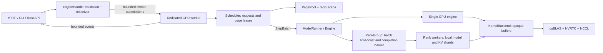

# Architecture

| Crate | Dependencies within the workspace | Responsibility |
|---|---|---|
| core | none | Protocol, sampling, runtime config, synchronous-completion runner contract |
| distributed | core | CPU TP layout/checkpoint slices, rank messages and completion barrier |
| kernels | core, distributed | Device resources, checked tensor operations, CUDA compatibility implementation |
| models | core, distributed, kernels | Checkpoint config, rank-local shard loading, Qwen3 dense/MoE and GPT-OSS layers |
| cache | core | Pure CPU page references, reservations, naive/radix caches |
| engine | core, distributed, kernels, models | Physical per-layer KV, forward execution, greedy/stochastic sampling |
| runtime | core, cache, engine | Scheduler, worker lifecycle, tokenizer/template, streams and metrics |
| server | core, runtime | CLI, HTTP/SSE and benchmark |

Within `models`, `config.rs` validates Qwen3 architecture/dimensions and checkpoint
metadata, `weights.rs` validates Qwen3 safetensors and uploads rank-local slices,
and `qwen3.rs` constructs layers and runs dense/MoE forward execution. GPT-OSS
has separate configuration, checkpoint-range loading, and forward modules.
`kernels/src/interface.rs` defines the backend-independent `KernelBackend`
contract; CUDA resources and checked operations remain inside the kernels crate.

`model.rs` defines the model contracts and centralized loading factory:

- `ModelConfiguration` exposes dimensions, TP validation, EOS metadata, and
  a default paged K/V memory calculation. Each concrete configuration implements
  it. `ModelConfig` retains strongly typed variants for loading and cloning
  across rank initialization; its `configuration()` method provides a trait view.
- `InferenceModel<B>` is an object-safe execution interface with `dimensions`,
  `allocate_kv`, `forward_hidden`, and `project`. Qwen3 and GPT-OSS implement it
  alongside their concrete APIs. The default KV allocator uses the shared
  `LayerKv<T>` structure and rank-local head count.
- `load_model` selects a concrete architecture during initialization and returns
  `Box<dyn InferenceModel<B>>`. Each engine owns that object and its configuration.
  Forward execution calls the trait directly. Dynamic dispatch occurs at model
  operation boundaries; layer and kernel calls remain generic over backend `B`.

To add a model, implement its configuration and `InferenceModel<B>` in the
model-specific modules, export the types, and register them in `model.rs`:
add the `ModelConfig` variant and arms in `load`, `configuration`, and
`load_model`. Existing configuration forwarding methods, Engine, scheduler,
cache, and server do not require architecture branches. New operators require
implementing their backend capabilities. A model needing another physical KV
representation would require extending the K/V contract as well.

The model trait has no `Send`/`Sync` requirement: each rank constructs and owns
its model on its worker thread. CUDA handles and mutable KV state do not cross
threads through the trait object.

The [trait refactor regression report](../results/model-trait/report.json)
records 30 passing CPU tests and 288 passing Qwen3/GPT-OSS HF comparisons at TP
1/2/4. All 240 available pre-refactor logits rows compare byte-for-byte equal.

GPT-OSS fetches expert weights on demand from BF16 tensors or MXFP4 blocks/scales,
then uploads them for the selected rows. Temporary expert buffers are dropped
after an ordered completion boundary. See [GPT-OSS](gpt-oss.md) for numerical
and serving limits.

The runtime worker owns the scheduler and its ModelRunner. Single-GPU mode constructs/owns its engine on that thread. TP mode uses RankGroup: each GPU thread constructs/owns a rank-local engine, and all ranks receive matching CPU batches. Only rank 0 samples; every rank completes its stream before the coordinator returns. CPU cache metadata never holds device pointers. `StepBatch` contains token IDs, logical positions, page IDs, and optional sampling parameters; metadata construction validates page coverage, vocabulary bounds, and unique write slots before GPU work.

## State and ownership

Requests enter waiting, then prefilling, then decoding, and terminate through one cleanup function. Intermediate prefill chunks produce KV without sampling. The last prompt chunk produces the first output token. That sampled token is added to host history; its KV is computed by the following decode step. Consequently `computed` may be one token behind host history. Only computed KV can enter the prefix cache.

`PageLease` is not clonable and exposes read-only page access. Requests hold one reference per page; radix nodes hold another reference to their cached pages. Pin counts on the matched radix path prevent eviction during use. New cache insertion pins the replacement handle before unpinning the previous handle. Duplicate physical pages for an already-cached logical prefix remain private to their current request and are freed when it finishes.

Radix edges contain whole pages of tokens. Matching excludes the final prompt token before page alignment, so the final logits are recomputed. Shared full pages are immutable; a partial tail page is always private. Arena nodes use integer IDs, with reusable vacant slots and no parent/child reference cycles. Eviction selects the least-recently-used unpinned leaf and can then evict newly exposed parent leaves.

Admission reserves the worst-case private pages for prompt plus maximum output. Physical pages are allocated incrementally; each allocation consumes a reservation. Availability includes free and evictable pages, less outstanding reservations. After all active requests end, each physical page belongs to either the free list or the radix tree. Integrity checks include reference counts, free-list uniqueness, and reservation conservation.

## Scheduling and execution

The scheduler alternates homogeneous prefill and decode batches when both are runnable. FIFO prefill chunks share a token budget; decode advances each running sequence once. This bounds the time a long prompt can delay existing decode requests. Admission and ingress processing are bounded independently of output delivery.

Each rank uses one explicit ordered compute/communication stream. Normal steps synchronize before returning tokens or changing CPU page ownership. Cancellation is an atomic signal checked at step boundaries; it never releases an in-flight page. The API does not lock shared model/KV state. Backpressure is handled with `try_send`, so a slow client cannot stall another request.

BF16 weight/activation/KV buffers have backend-specific opaque types. GEMM accumulates in FP32; LM head output is FP32. Norm and attention reductions use FP32. RoPE frequencies are cached once per `(head_dim, theta)` and use HF's split-half rotation convention. Qwen3 head dimension is explicit, including the 0.6B checkpoint whose Q width differs from hidden size.

cuBLAS is initialized with `CUBLAS_MATH_DISALLOW_REDUCED_PRECISION_REDUCTION`, preserving FP32 partial reductions as well as FP32 accumulation. See the [CUDA 12.6 cuBLAS math-mode reference](https://docs.nvidia.com/cuda/archive/12.6.1/cublas/index.html#cublasmath-t).

Greedy argmax runs on the GPU with the smaller token ID winning ties. Stochastic rows are copied to the CPU, sorted with deterministic tie breaking, filtered by top-k/nucleus probability, and sampled with a request-specific ChaCha8 RNG. RNG state is removed at termination.

## Failure boundaries

Input validation rejects unknown parameters, empty/out-of-range IDs, invalid sampling, excessive context, and permanently impossible KV requirements. Those failures do not poison the worker. Runner failures shut down the worker, fail active/queued streams, clear cache ownership, and set health to stopped. Ordinary end, EOS, cancellation, disconnection, and output-channel overflow share the same page-release path.

Only `kernels` permits Rust unsafe code. It checks shapes, device contexts, launch dimensions, buffer sizes, and metadata before issuing a launch. cuBLAS pointer guards and cudarc event tracking keep buffers ordered and alive; stream synchronization establishes the boundary where page reuse is legal. There are no raw pointers in distributed coordination, model, scheduler, cache, server, or public generation types.

## Tensor parallelism

See [TP coverage and implementation](tensor-parallel.md). Logical page IDs and radix metadata are global to the scheduler; every rank stores the corresponding local KV-head shard. Shared full prefix pages are read-only on every rank. Physical page recycling and cancellation occur only after the multi-rank completion barrier. KV heads replicate across adjacent ranks when TP exceeds their count.

The communication backend dynamically loads NCCL >= 2.27 and owns its reusable transport buffers. Rank failures abort all communicators concurrently before joining workers. Checkpoint decoding selects only rank-local tensor values before GPU upload; norms/router are replicated. Model code remains generic over KernelBackend and never accesses NCCL/CUDA handles.
